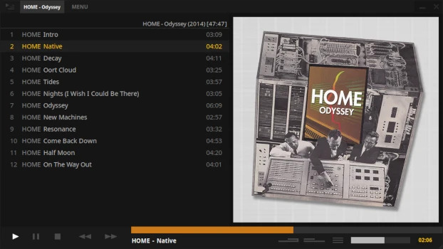
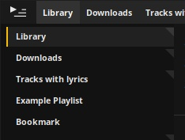

This guide covers all the major interface elements in Tauon Music Box.

## The Top Panel

The top panel contains the playlist tabs. Click a playlist tab to switch the tracklist view to that playlist. You can also **mouse wheel scroll** to cycle through them.

:::note
Playback from any originally started playlist will still continue from that playlist.
:::

### Managing Playlists

- **Create new playlist** - Click MENU, then "New Playlist"
- **Delete playlist** - Middle mouse click on the tab
- **Add tracks to playlist** - Drag tracks from the tracklist and drop them onto a playlist tab
- **Create new playlist from tracks** - Drag and drop tracks to the right of all the playlist tabs
- **Re-arrange tabs** - Drag tabs to re-order them
- **Merge playlists** - Hold `Shift` while dragging a tab onto another
- **Duplicate playlist** - Hold `Ctrl` while dragging to the right of all tabs

## The Bottom Panel

### Playback Controls (Left Side)

- **Play button** - Start playback
  - *Right click* to **go to playing** - Locates the currently playing track in the tracklist
  
- **Pause button** - Pause playback

- **Stop button** - Stop playback
  - *Right click* to activate **auto-stop** (stops at the end of current track)

- **Previous button** - Previous track
  - *Right click* to toggle **repeat mode**
  - With shuffle on, plays tracks from playback history

- **Next button** - Next track
  - *Right click* to toggle **shuffle mode**

### Playback Controls (Right Side)

- **Playback time indicator** - Click to cycle display modes:
  - Time elapsed
  - Time remaining
  - Elapsed + track length
  - Album elapsed + album length

- **Volume bar** - Adjust playback volume

- **Playback menu** - Additional playback options

- **Shuffle toggle** - Enable/disable shuffle
  - *Right click* for shuffle menu

- **Repeat toggle** - Enable/disable repeat
  - *Right click* for repeat menu with options like Repeat Album

:::tip[Album Shuffle]
Want to shuffle tracks within a single album? Activate both **Repeat Album** and standard shuffle!
:::

### Seek Bar

The **seek bar** runs along the top of the bottom panel. You can:
- Click to jump to a position
- *Middle mouse click* to bring up a time cursor

## The Right Side Panel

The right side panel displays album information and can be resized by dragging the left edge.

### Album Art Display

The top half shows the **album art**.
- Click the album art to cycle through any available images
- Hold `Shift` while hovering to see the image resolution

### Track Metadata

The bottom half displays track metadata including:
- Track title
- Artist
- Album
- Additional tags

### Lyrics View

*Right click* the metadata area to access the **lyrics menu**. When "Show lyrics" is enabled, the panel will automatically switch to lyrics layout when lyrics are available.

### Layout Options

- **Resize** - Drag the left edge to resize the panel
- **Large art mode** - Resize the panel toward the left for a large album art layout
- **Centered style** - *Middle mouse click* in the side panel to toggle an alternate centered layout

## The Left Side Panel

Toggle the left side panel by clicking the **top-left corner button**. *Right click* the toggle button to switch between different views.

### Available Views

1. **Playlists + Queue** - Lists all playlists
2. **Artist List** - Browse by artist
3. **Folder Navigator** - Navigate your folder structure

### Playlists + Queue

Lists all of your playlists. These behave similar to the top panel tabs.

You can **unpin** a playlist from the top panel using the tab's right click context menu. Keep tabs pinned when you want quick access to them.

### Folder Navigator

Lists folders in the current playlist in a tree-style layout.

- **Double click** a folder to play it
- **Single click** to locate that folder in the playlist

:::tip[Organizing Your Collection]
If you have a large music collection, consider keeping it divided into separate sub-folders (e.g., by genre). This allows for easier navigation using the folder navigator.
:::

:::caution[Move Folder Feature]
The context menu has a "Move playing folder here" option that performs a **physical** move of the folder on disk. The folder will be placed in a sub-folder named after the artist. Use with caution!
:::

## The Main Tracklist

The tracklist is where all your tracks are displayed.

### Selecting Tracks

- **Single track** - Click on it
- **Album block** - Click the album title in the tracklist
- **Range** - Click the first track, hold `Shift`, click the last track

### Re-arranging Tracks

- Move/add tracks by **drag and drop** or **copy and paste**
- Moving a single track requires holding `Shift` when dragging

:::note[Paste Behavior]
- Using **paste from context menu** adds tracks at the end of the selected track's album block
- Using **`Ctrl` + `V`** adds tracks to the end of the viewed playlist
:::

### Scrolling

- Use the **mouse wheel** to scroll
- A **scroll-bar** appears on the left when you mouse over
  - Hold mouse button above/below the grip to scroll quickly
  - *Right click* to jump to an absolute position
