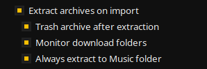

Tauon can monitor your downloads folder and make it easy to import new music with just one click.


## How It Works

When a new music archive or folder is detected in your downloads folder, a button appears that lets you immediately import that item.

:::note
Files older than one hour are ignored
:::

## Setup

To enable this feature, go to **MENU > Settings... > Functions** and enable:

1. **"Monitor download folders"** - Watches for new files
2. **"Extract archives on import"** - Automatically extracts compressed files

Optional settings:
- **"Trash archive after extraction"** - Removes the archive after extracting
- **"Always extract to music folder"** - Extracts to your music library folder



## Default Import Playlist

Items will be imported to the playlist you've flagged as the **downloads playlist**. To set this:

1. Right click a playlist tab
2. Select **"Misc..." > "Set as Downloads Playlist"**

If no downloads playlist is set, items will be imported to the currently viewed playlist.


## Supported Formats

- **Folders** - Drag and drop or auto-detect
- **ZIP archives** - Automatically extracted
- **7z archives** - Requires additional setup (see below)
- **RAR archives** - Requires additional setup (see below)


## 7z and RAR Support

To use 7z and RAR archives, you need to install additional packages:

**Arch Linux**
```bash
# Install optional packages
sudo pacman -S unrar p7zip
```

**Flatpak**
```bash
# Install host packages
sudo apt install unrar p7zip-full  # Ubuntu/Debian
# or
sudo dnf install unrar p7zip        # Fedora

# Grant permission to run commands in host environment
sudo flatpak override com.github.taiko2k.tauonmb --talk-name=org.freedesktop.Flatpak
```

## Tips

- Keep your downloads folder organized for best results
- The feature works great with music downloads from Bandcamp, etc.
- You can disable auto-trash of archives if you want to keep backups
