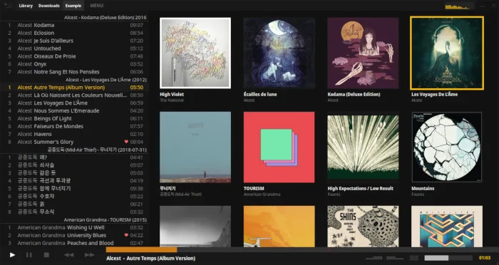

The gallery view provides a visual way to browse your music collection by album art.

## Entering Gallery View

There are several ways to enter the gallery:

1. Click **MENU**, then click the gallery layout icon (2nd from the top)
2. Press **mouse button 4** (the button closer to you on a 5-button mouse)
3. Press `Tab` to enter in "keyboard control mode"

## Using the Gallery

To play an album, just **click it**. This is a single click by default, but you can change it to double-click in settings:

Go to **MENU > Settings... > View** and un-check "Single click to play"

## Keyboard Control Mode

When you press `Tab` to enter the gallery, you'll be in keyboard control mode where you can navigate using:

- Arrow keys to move between albums
- `Enter` to play the selected album
- `Esc` to exit back to the tracklist view

The gallery is perfect for when you want to browse your collection visually and discover albums based on their artwork!
