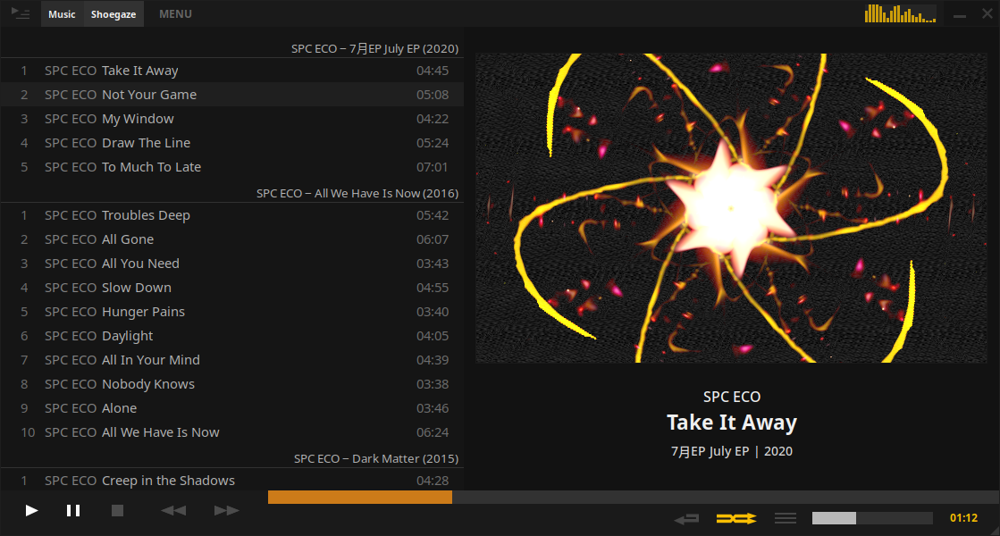

**Feature to be added in Tauon Music Box 9.0.0**

This feature allows you to load Winnamp style `.milk` visualisations presets. Powered by [ProjectM](https://projectm-visualizer.org/).

:::note[Arch Linux Users]
For this feature you will need to install the package `projectm-git` from the [AUR](https://aur.archlinux.org/packages/projectm-git).
:::

:::caution[Windows/macOS Users]
This feature is currently not supported on Windows and macOS builds.
:::

To enable, right click the right side panel album art and choose `Enable Milkdrop Visualiser`.

Middle click to toggle between square and wide aspect ratio.

Click the visualiser to change to a random one. You can toggle **auto advance** from the context menu.

### Installing presets:

If no presets are present you will be prompted to download a small curated preset pack. Otherwise, you can add your own presets by placing them in the preset folder. Presets must be in `.milk` "v1" format.

 - You can open the preset folder directly from the context menu.
 - You can drag and drop a `.milk` file directly into Tauon to load it immediately.

 There are a lot of presets out there on the internet but compatibility isn't perfect. Some may show artifacts or display as a black or white screen.