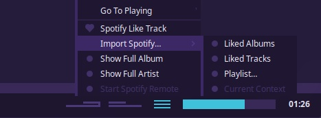
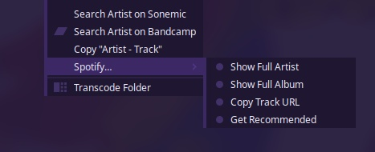

import { Aside } from '@astrojs/starlight/components';
import { Steps } from '@astrojs/starlight/components';

## Overview

This feature allows for the importing, searching and playback control of Spotify music from within Tauon.

:::note
This feature will only work with a **Spotify premium account**.
:::

<Aside type="danger" icon="down-arrow" title="Unmaintained">
  This feature may not be actively maintained, may be buggy and not represent the best Tauon has to offer.
</Aside>

## Setup

<Steps>
1. Create an ***app*** in the [Spotify developer dashboard](https://developer.spotify.com/dashboard/applications).
2. Edit the app settings adding the following **Redirect URL**: `http://127.0.0.1:7811/spotredir`. (Make sure to scroll to the bottom and click **save**!)
3. Copy the **Client ID** and **Client Secret**, and paste them in Tauon Music Box under `MENU` > `Settings` > `Accounts` > `Spotify`.
2. In that same settings section of Tauon Music Box, click the `Authorise` button. You will be redirected to Spotify to log in.
3. Back in Tauon Music Box, click the **`Enable`** toggle next to the Spotify tab to toggle on the Spotify specific features.
</Steps>

## Importing tracks

Most Spotify specific functions will appear in the *playback hamburger menu* as shown above. From this menu you can import your liked tracks, your playlists etc.

<Aside type="tip">
If you want access to the "Release Radar" and "Discover Weekly" playlists, you can ***save*** them in the Spotify app, then they'll appear in the Import Spotify &gt; Playlist... list.
</Aside>

You can also import via Spotify URL's by pressing <kbd>Ctrl</kbd> + <kbd>v</kbd> to paste them on the main window. This will import the album to the end of the current playlist in the case of album URL's, or create a new playlist in the case of artist and playlist URL's.

You can **Search** for albums and artists. To do so, type your search query (this will trigger the standard global search). Then, press <kbd>Tab</kbd> to switch from local search to Spotify search.

<Aside type="note">
This search function provided by the Spotify API isn't as good as the search on the official client/website. I'd suggest searching using the Spotify website then paste the URL of content you want into Tauon.
</Aside>

## Remote control monitor

You can *monitor* active playback from a remote Spotify device by clicking the bottom hamburger menu > `Start Spotify Remote`. In this mode Tauon will just show you what's playing. If you manually start playing a Spotify track in Tauon, Tauon will take over control of playback.

## Audio Playback

There are two modes of audio playback:

 1. Through an external Spotify player such as the official Spotify client app. 
    - This is the default setting. 
    - Tauon will try launch Spotify automatically if an instance isn't detected.
 2. Through Tauon itself.
    - See MENU > Settings > Accounts > Spotify > Enable local audio playback.
   

## Tips

 - If you have a Spotify Connect speaker you want to use, you'll need to do the switching using the Spotify app.
 - You can refresh a playlist in Tauon by right clicking the playlist tab and clicking "Regenerate".
 - There are some track context menu functions such as Show Full Album and Get Recommended Tracks.
    

   